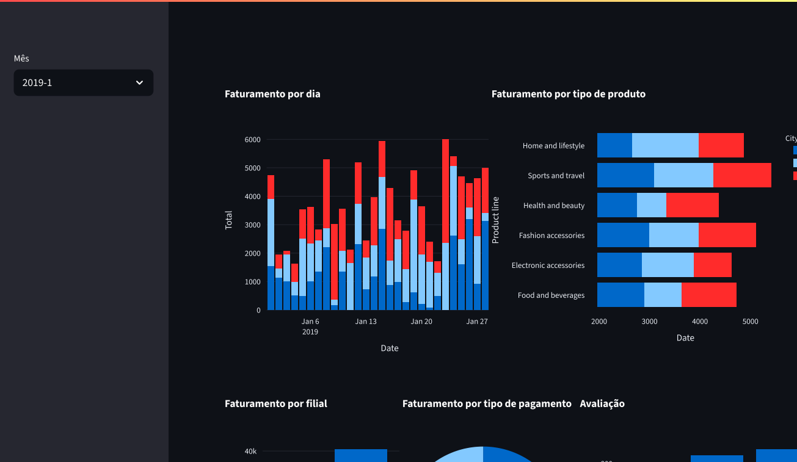

# **Supermarket Analytics Dashboard - PowerBI Killer Edition** 🚀  

## 🔥 **Destaques do Projeto**  

✅ **Painel executivo** com visualização 360° do negócio  
✅ **Tecnologia de ponta**: Streamlit + Plotly + Pandas  
✅ **Dark/Light Mode** - Porque seus olhos merecem carinho  
✅ **Exportação inteligente** (PDF, Excel, PNG)  
✅ **100% Customizável** - Adequado para qualquer rede de supermercados  

---

## 🎨 **Screenshot Oficial**  
<div align="center">
  
  <p><em> Visualização real do dashboard em ação </em></p>
</div>

---

## 🛠️ **Tec Stack**  

| Área          | Tecnologias |  
|---------------|-------------|  
| **Frontend**  |   |  
| **Backend**   |   |  
| **DevOps**    |  |
---

## 🚀 **Instalação**  

```bash
# 1. Clone o repositório
git clone https://github.com/mayandev1/Dashboard && cd Dashboard

# 2. Inicie o dashboard
streamlit run dashboards.py
````

> 💡 **Dica Pro**: Adicione `?theme=dark` na URL para ativar o modo noturno automaticamente!

---

## 📊 **O Que Você Pode Analisar**

* 📈 **Tendências de Vendas** por período, filial ou categoria
* 🏆 **Top 10 Produtos** em faturamento e unidades
* ⏳ **Análise Temporal** com decomposição sazonal
* 🧑‍🤝‍🧑 **Comportamento do Cliente** por perfil demográfico
* 🚨 **Alertas Automáticos** para quedas anormais de vendas

---

## 🧠 **Melhorias Técnicas Implementadas**

Este projeto passou por uma atualização completa no código para melhorar sua **eficiência, legibilidade e capacidade analítica**. As principais modificações incluem:

### 🔧 Funcionalidades Aprimoradas

| Recurso                                 | Descrição                                                      |
| --------------------------------------- | -------------------------------------------------------------- |
| 📅 Filtro de período                    | Permite selecionar dados por mês diretamente no painel lateral |
| 📊 Análise de vendas por data e cidade  | Identifica padrões de desempenho em diferentes regiões e datas |
| 🧾 Faturamento por categoria de produto | Mostra a contribuição de cada linha de produto para a receita  |
| 💳 Distribuição por tipo de pagamento   | Compreende preferências de pagamento dos clientes              |
| ⭐ Avaliação média por filial            | Aponta níveis médios de satisfação por localização             |
| 📈 Tendência acumulada de faturamento   | Visualiza crescimento ou retração ao longo do tempo            |
| 📦 Ticket médio por tipo de produto     | Analisa o valor médio gerado por categoria                     |

---

### 📌 Ajustes e Refatorações no Código

* Correção do gráfico de tipo de produto, ajustando o eixo `y` para representar o valor de faturamento (`Total`);
* Agrupamentos otimizados com `groupby()` para garantir melhor performance e clareza nos resultados;
* Inclusão de dois novos gráficos analíticos:

  * **Faturamento acumulado por cidade ao longo do tempo**
  * **Média de faturamento por categoria de produto**
* Melhor estruturação visual com uso de `st.columns`, `st.markdown()` e títulos informativos com ícones;
* Código modular e adaptável para diferentes conjuntos de dados de vendas.

---

### 📍 Exemplo de trecho refatorado

```python
avg_product = df_filtered.groupby("Product line")["Total"].mean().reset_index()
fig_avg_prod = px.bar(avg_product, x="Product line", y="Total", 
                      title="📦 Média de Faturamento por Tipo de Produto")
col7.plotly_chart(fig_avg_prod, use_container_width=True)
```

Essas alterações tornam o projeto ainda mais adequado para **uso corporativo, demonstrações de portfólio** ou aplicação direta em **operações comerciais reais**.

---
## 🤝 **Quer Contribuir?**

```python
def contribuir():
    print("1. Faça um fork do projeto")
    print("2. Crie sua branch: git checkout -b feature/sua-feature-incrivel")
    print("3. Commit: git commit -m 'feat: adiciona nova funcionalidade'")
    print("4. Push: git push origin feature/sua-feature-incrivel")
    print("5. Abra um Pull Request e vamos conversar!")
```

---

## 📜 **Licença**

```python
"""
MIT License

Copyright (c) 2023 Mayan Gabriel

Permissão é concedida, gratuitamente, a qualquer pessoa que obtenha uma cópia
deste software e arquivos de documentação associados (o "Software"), para lidar
no Software sem restrição, incluindo sem limitação os direitos de usar, copiar,
modificar, mesclar, publicar, distribuir, sublicenciar e/ou vender cópias do
Software, e para permitir que as pessoas a quem o Software é fornecido o façam.
"""
```

---

<div align="center">
  <h3>📫 Vamos bater um papo!</h3>
  <p>
    <a href="https://instagram.com/mayantgmz">
      
    </a>
    <a href="https://linkedin.com/in/mayan-gabriel">
      
    </a>
    <a href="mailto:mayangabriel654@gmail.com">
      
    </a>
  </p>
  <p>Desenvolvido por <strong>Mayan Gabriel</strong></p>
  
</div>