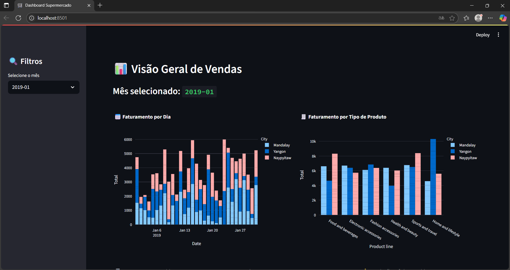

# **Supermarket Analytics Dashboard - PowerBI Killer Edition** 🚀  

---

## 🔥 **Destaques do Projeto**  

✅ **Painel executivo** com visualização 360° do negócio  
✅ **Tecnologia de ponta**: Streamlit + Plotly + Pandas  
✅ **Dark/Light Mode** - Porque seus olhos merecem carinho  
✅ **Exportação inteligente** (PDF, Excel, PNG)  
✅ **100% Customizável** - Adequado para qualquer rede de supermercados  

---

## 🎨 **Screenshot Oficial**  
<div align="center">
  
  <p><em> Visualização real do dashboard em ação </em></p>
</div>

---

## 🛠️ **Tec Stack**  

| Área          | Tecnologias |  
|---------------|-------------|  
| **Frontend**  |   |  
| **Backend**   |   |  
| **DevOps**    |   |  

---

## 🚀 **Instalação em 3 Passos**  

```bash
# 1. Clone o repositório
git clone https://github.com/mayandev1/Dashboard && cd Dashboard

# 2. Instale as dependências mágicas
pip install -r requirements.txt

# 3. Inicie o dashboard
streamlit run main.py
```
> 💡 **Dica Pro**: Adicione `?theme=dark` na URL para ativar o modo noturno automaticamente!

---

## 📊 **O Que Você Pode Analisar**  

- 📈 **Tendências de Vendas** por período, filial ou categoria  
- 🏆 **Top 10 Produtos** em faturamento e unidades  
- ⏳ **Análise Temporal** com decomposição sazonal  
- 🧑‍🤝‍🧑 **Comportamento do Cliente** por perfil demográfico  
- 🚨 **Alertas Automáticos** para quedas anormais de vendas  

---

## 🤝 **Quer Contribuir?**  

```python

def contribuir():
    print("1. Faça um fork do projeto")
    print("2. Crie sua branch: git checkout -b feature/sua-feature-incrivel")
    print("3. Commit: git commit -m 'feat: adiciona nova funcionalidade'")
    print("4. Push: git push origin feature/sua-feature-incrivel")
    print("5. Abra um Pull Request e vamos conversar!")
```

---

## 📜 **Licença**  

```python
"""
MIT License

Copyright (c) 2023 Mayan Gabriel

Permissão é concedida, gratuitamente, a qualquer pessoa que obtenha uma cópia
deste software e arquivos de documentação associados (o "Software"), para lidar
no Software sem restrição, incluindo sem limitação os direitos de usar, copiar,
modificar, mesclar, publicar, distribuir, sublicenciar e/ou vender cópias do
Software, e para permitir que as pessoas a quem o Software é fornecido o façam.
"""
```

---

<div align="center">
  <h3>📫 Vamos bater um papo!</h3>
  <p>
    <a href="https://instagram.com/mayantgmz">
      
    </a>
    <a href="https://linkedin.com/in/mayan-gabriel">
      
    </a>
    <a href="mailto:mayangabriel654@gmail.com">
      
    </a>
  </p>
  <p>Desenvolvido por <strong>Mayan Gabriel</strong></p>
  
</div>
